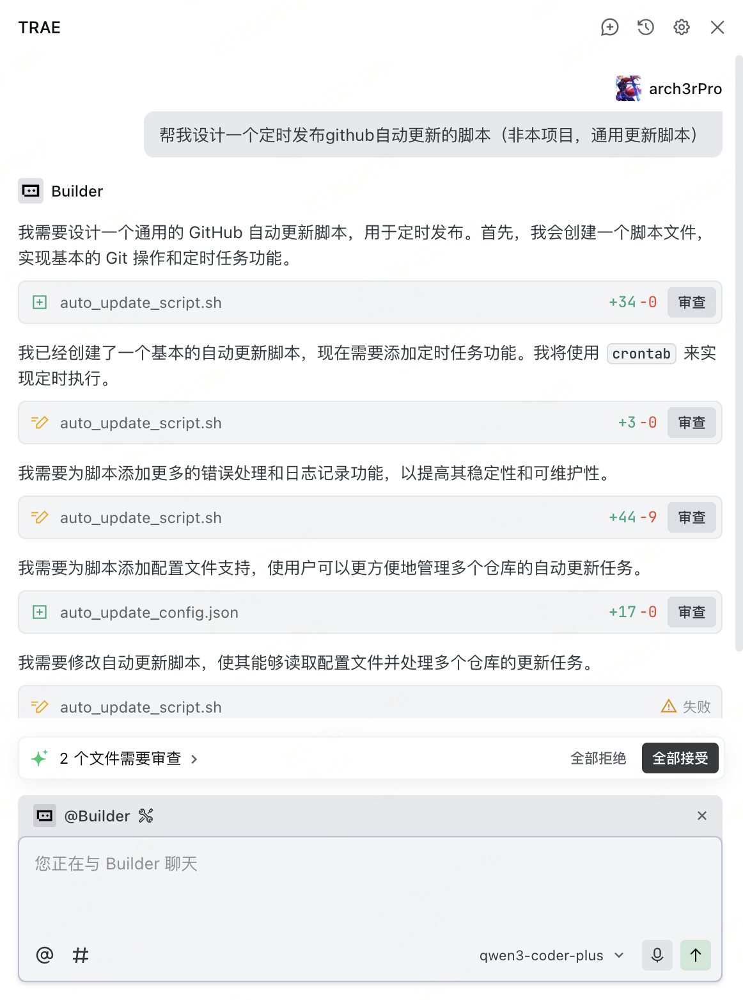

<div align="center">
  
  <h1>Trae Proxy</h1>
</div>

[English](README.md) | [简体中文](README_zh.md)

 A high-performance, low-latency API proxy middleware designed for large language model applications, capable of seamlessly intercepting and redirecting OpenAI API requests to any custom backend service. Supports multi-backend load balancing, intelligent routing, dynamic model mapping, and streaming response handling, allowing you to break through official API limitations and freely choose and integrate various LLM services while maintaining complete compatibility with existing applications.

## 📢 Introduction

1. Trae IDE currently supports custom model providers, but only those fixed in the list, and does not support custom base_url, making it impossible to use your own API service.
2. There are many related issues on Github, but the official response is minimal, such as: [Add custom model provider base_url capability](https://github.com/Trae-AI/Trae/issues/1206), [Custom AI API Endpoint](https://github.com/Trae-AI/Trae/issues/963)
3. Based on this situation, Trae-Proxy was developed to proxy OpenAI API requests to custom backends, while supporting custom model ID mapping and dynamic backend switching.
4. We hope the official team will soon implement custom base_url capability, making Trae a truly customizable IDE.

## 📸 Screenshots

<div align="center">

<table>
<tr>
<td align="center">
<h3>Custom-Model</h3>

<br>
<em>Support for custom OpenAI-compatible APIs</em>
</td>
<td align="center">
<h3>IDE-Builder</h3>

<br>
<em>Integration with Qwen3-Coder-Plus model</em>
</td>
</tr>
</table>
</div>

## ✨ Key Features

- **Intelligent Proxy**: Intercept OpenAI API requests and forward them to custom backends
- **Multi-Backend Support**: Configure multiple API backends with dynamic switching
- **Model Mapping**: Custom model ID mapping for seamless model replacement
- **Streaming Response**: Support for both streaming and non-streaming response modes
- **SSL Certificates**: Automatic generation and management of self-signed certificates
- **Docker Deployment**: One-click containerized deployment for production environments

## ⚠️ Disclaimer

1. **Trae-Proxy** is a tool for intercepting and redirecting OpenAI API requests to custom backend services, without modifying or reverse engineering official software.
2. This tool is for learning and research purposes only. Users should comply with relevant laws, regulations, and service terms.
3. Theoretically, not only TraeIDE but also other IDEs or clients that support OpenAI SDK or API can seamlessly integrate with this tool.

## 🚀 Quick Start

Trae-Proxy installation and usage consists of the following steps:

1. Install, configure, and start the Trae-Proxy server
2. Install self-signed certificates on the client and modify hosts mapping (to forward OpenAI domain to the proxy service)
3. Add models in the IDE, select OpenAI as the provider, customize model ID, and enter API key

### Using Docker Compose (Recommended)

```bash
# Clone the repository
git clone https://github.com/arch3rpro/trae-proxy.git
cd trae-proxy

# Start the service
docker-compose up -d

# View logs
docker-compose logs -f
```

### Manual Deployment

```bash
# Install dependencies
pip install -r requirements.txt

# Generate certificates
python generate_certs.py

# Start the proxy server
python trae_proxy.py
```

### Configuration File Structure

Trae-Proxy uses a YAML format configuration file `config.yaml`:

```yaml
# Trae-Proxy configuration file
# Proxy domain configuration
domain: api.openai.com

# Backend API configuration list
apis:
  - name: "deepseek-r1"
    endpoint: "https://api.deepseek.com"
    custom_model_id: "deepseek-reasoner"
    target_model_id: "deepseek-reasoner"
    stream_mode: null
    active: true
  - name: "kimi-k2"
    endpoint: "https://api.moonshot.cn"
    custom_model_id: "kimi-k2-0711-preview"
    target_model_id: "kimi-k2-0711-preview"
    stream_mode: null
    active: true
  - name: "qwen3-coder-plus"
    endpoint: "https://dashscope.aliyuncs.com/compatible-mode"
    custom_model_id: "qwen3-coder-plus"
    target_model_id: "qwen3-coder-plus"
    stream_mode: null
    active: true
# Proxy server configuration
server:
  port: 443
  debug: true
```

## 🖥️ Client Configuration

### 1. Get Server Self-Signed Certificate

Copy the CA certificate from the server to your local machine:

```bash
# Copy CA certificate from server
scp user@your-server-ip:/path/to/trae-proxy/ca/api.openai.com.crt .
```

### 2. Install CA Certificate

#### Windows

1. Double-click the `api.openai.com.crt` file
2. Select "Install Certificate"
3. Select "Local Machine"
4. Select "Place all certificates in the following store" → "Browse" → "Trusted Root Certification Authorities"
5. Complete the installation

#### macOS

1. Double-click the `api.openai.com.crt` file, which will open "Keychain Access"
2. Add the certificate to the "System" keychain
3. Double-click the imported certificate, expand the "Trust" section
4. Set "When using this certificate" to "Always Trust"
5. Close the window and enter your administrator password to confirm

### 3. Modify Hosts File

#### Windows

1. Edit `C:\Windows\System32\drivers\etc\hosts` as administrator
2. Add the following line (replace with your server IP):
   ```
   your-server-ip api.openai.com
   ```

#### macOS

1. Open Terminal
2. Execute `sudo vim /etc/hosts`
3. Add the following line (replace with your server IP):
   ```
   your-server-ip api.openai.com
   ```

### 4. Test Connection

```bash
curl https://api.openai.com/v1/models
```

If configured correctly, you should see the model list returned by the proxy server.

## 🔧 System Requirements

- **Server**: Python 3.9+, OpenSSL, Docker
- **Client**: Administrator privileges (for modifying hosts file and installing certificates)

## 📁 Project Structure

```
trae-proxy/
├── trae_proxy.py          # Main proxy server
├── trae_proxy_cli.py      # Command-line management tool
├── generate_certs.py      # Certificate generation tool
├── config.yaml            # Configuration file
├── docker-compose.yml     # Docker deployment configuration
├── requirements.txt       # Python dependencies
└── ca/                    # Certificates and keys directory
```

## 🔍 How It Works

```
 +------------------+    +--------------+    +------------------+
 |                  |    |              |    |                  |
 |                  |    |              |    |                  |
 |  DeepSeek API    +--->+              +--->+  Trae IDE        |
 |                  |    |              |    |                  |
 |  Moonshot API    +--->+              +--->+  VSCode          |
 |                  |    |              |    |                  |
 |  Aliyun API      +--->+  Trae-Proxy  +--->+  JetBrains       |
 |                  |    |              |    |                  |
 |  Self-hosted LLM +--->+              +--->+  OpenAI Clients  |
 |                  |    |              |    |                  |
 |  Other API Svcs  +--->+              |    |                  |
 |                  |    |              |    |                  |
 |                  |    |              |    |                  |
 +------------------+    +--------------+    +------------------+
   Backend Services       Proxy Server        Client Apps
```

## 💡 Use Cases

- **API Proxy**: Forward OpenAI API requests to privately deployed model services
- **Model Replacement**: Replace official OpenAI models with custom models
- **Load Balancing**: Distribute requests among multiple backend services
- **Development Testing**: API simulation and testing in local development environments

## 📝 License

This project is licensed under the MIT License - see the [LICENSE](LICENSE) file for details.