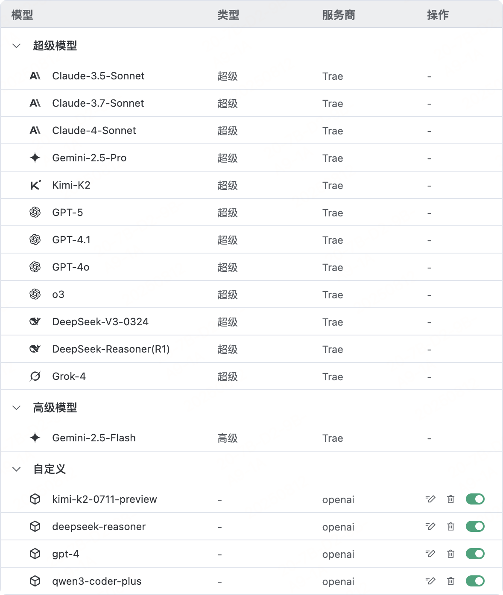
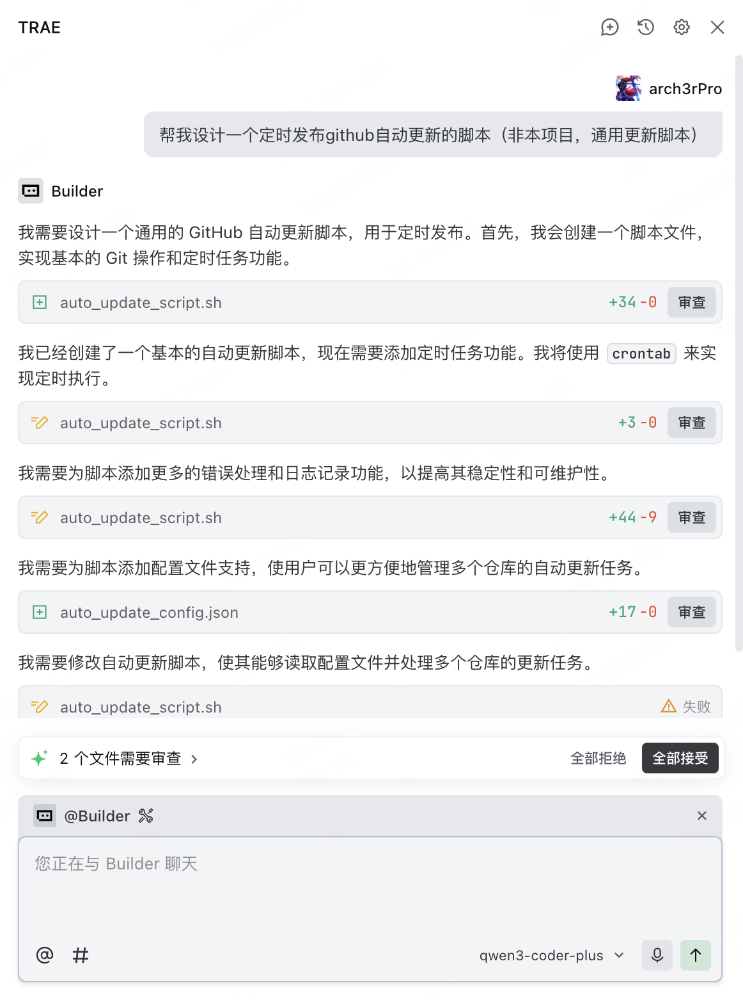
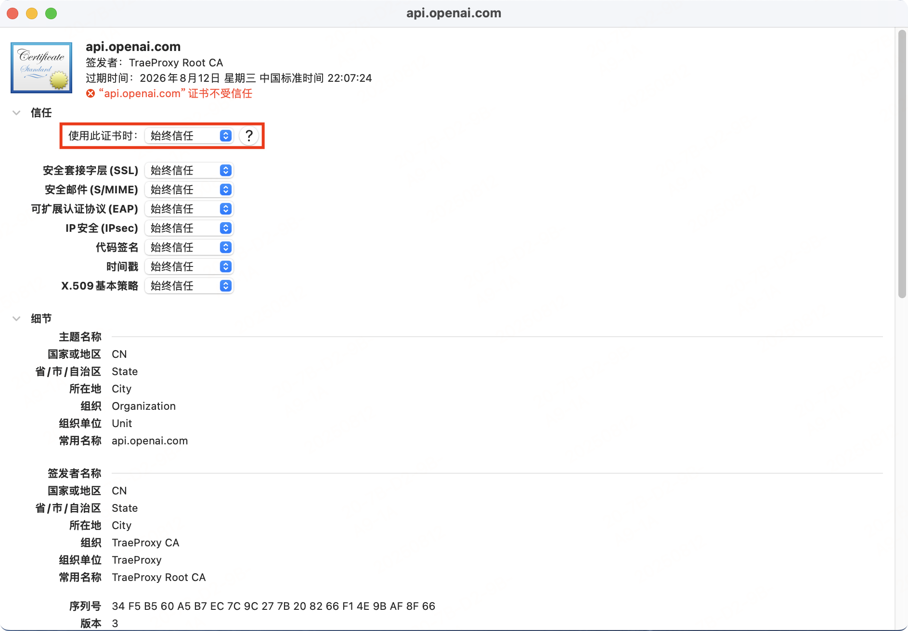

<div align="center">
  
  <h1>Trae Proxy</h1>
</div>

[English](README.md) | [简体中文](README_zh.md)

 一个智能的API代理工具，专门用于拦截和重定向OpenAI API请求到自定义后端服务。支持多后端配置、动态模型映射和流式响应处理。


## 📢 引言

1. Trae IDE 目前支持自定义模型服务商，但是仅支持列表内固定的模型服务商，不支持自定义 base_url，所以无法使用自己的API服务。
2. Github上有不少提出相关的Issue，但是官方基本处于不处理状态，如：[增加自定义模型服务商 base_url 的能力](https://github.com/Trae-AI/Trae/issues/1206)、[自定义 AI 路由 Custom AI API Endpoint](https://github.com/Trae-AI/Trae/issues/963)
3. 基于上述情况，开发了Trae-Proxy，以代理方式将OpenAI的API请求转发到自定义后端，同时支持自定义模型ID映射和动态后端切换。
4. 希望官方早日上线自定义base_url的能力，使Trae成为真正可自定义的IDE。

## 📸 截图

<div align="center">

<table>
<tr>
<td align="center">
<h3>Custom-Model</h3>

<br>
<em>支持自定义Openai兼容API</em>
</td>
<td align="center">
<h3>IDE-Builder</h3>

<br>
<em>接入的Qwen3-Coder-Plus模型</em>
</td>
</tr>
<tr>
<td align="center" colspan="2">
<h3>SSL-Certificate</h3>

<br>
<em>设置信任自签证证书</em>
</td>
</tr>
</table>
</div>

## ✨ 主要功能

- **智能代理**: 拦截OpenAI API请求并转发到自定义后端
- **多后端支持**: 配置多个API后端，支持动态切换
- **模型映射**: 自定义模型ID映射，无缝替换目标模型
- **流式响应**: 支持流式和非流式响应模式切换
- **SSL证书**: 自动生成和管理自签名证书
- **Docker部署**: 一键容器化部署，支持生产环境

## ⚠️ 声明

1. **Trae-Proxy** 是一个拦截和重定向OpenAI API请求到自定义后端服务的工具，不涉及任何修改和逆向官方软件的行为。
2. 本工具仅用于学习和研究目的，使用者应遵守相关法律法规和服务条款。
3. 理论上不仅是TraeIDE，其他支持接入OpenAI SDK或API的服务的IDE或者客户端，都可以无缝接入。

## 🚀 快速开始

Trae-Proxy安装和使用分为以下几个步骤：

1. Trae-Proxy服务端安装、配置、启动；
2. 客户端安装自签名证书，修改Hosts映射；（将openai域名转发到代理服务上）
3. IDE中添加模型，服务商选择OpenAI，自定义模型ID，输入API密钥；

### 使用Docker Compose（推荐）

```bash
# 克隆仓库
git clone https://github.com/arch3rpro/trae-proxy.git
cd trae-proxy

# 启动服务
docker-compose up -d

# 查看日志
docker-compose logs -f
```

### 手动部署

```bash
# 安装依赖
pip install -r requirements.txt

# 生成证书
python generate_certs.py

# 启动代理服务器
python trae_proxy.py
```

### 配置文件结构

Trae-Proxy 使用YAML格式的配置文件 `config.yaml`：

```yaml
# Trae-Proxy 配置文件
# 代理域名配置
domain: api.openai.com

# 后端API配置列表
apis:
  - name: "deepseek-r1"
    endpoint: "https://api.deepseek.com"
    custom_model_id: "deepseek-reasoner"
    target_model_id: "deepseek-reasoner"
    stream_mode: null
    active: true
  - name: "kimi-k2"
    endpoint: "https://api.moonshot.cn"
    custom_model_id: "kimi-k2-0711-preview"
    target_model_id: "kimi-k2-0711-preview"
    stream_mode: null
    active: true
  - name: "qwen3-coder-plus"
    endpoint: "https://dashscope.aliyuncs.com/compatible-mode"
    custom_model_id: "qwen3-coder-plus"
    target_model_id: "qwen3-coder-plus"
    stream_mode: null
    active: true
# 代理服务器配置
server:
  port: 443
  debug: true
```

## 🖥️ 客户端配置

### 1. 获取服务器自签证书

从服务器复制CA证书到本地：

```bash
# 从服务器复制CA证书
scp user@your-server-ip:/path/to/trae-proxy/ca/api.openai.com.crt .
```

### 2. 安装CA证书

#### Windows 系统

1. 双击 `api.openai.com.crt` 文件
2. 选择"安装证书"
3. 选择"本地计算机"
4. 选择"将所有证书放入下列存储" → "浏览" → "受信任的根证书颁发机构"
5. 完成安装

#### macOS 系统

1. 双击 `api.openai.com.crt` 文件，系统会打开"钥匙串访问"
2. 将证书添加到"系统"钥匙串
3. 双击导入的证书，展开"信任"部分
4. 将"使用此证书时"设置为"始终信任"
5. 关闭窗口并输入管理员密码确认

### 3. 修改hosts文件

#### Windows 系统

1. 以管理员身份编辑 `C:\Windows\System32\drivers\etc\hosts`
2. 添加以下行（替换为您的服务器IP）：
   ```
   your-server-ip api.openai.com
   ```

#### macOS 系统

1. 打开终端
2. 执行 `sudo vim /etc/hosts`
3. 添加以下行（替换为您的服务器IP）：
   ```
   your-server-ip api.openai.com
   ```

### 4. 测试连接

```bash
curl https://api.openai.com/v1/models
```

如果配置正确，您应该能看到代理服务器返回的模型列表。


## 🔧 系统要求

- **服务器端**: Python 3.9+, OpenSSL, Docker
- **客户端**: 管理员权限（修改hosts文件、安装证书）

## 📁 项目结构

```
trae-proxy/
├── trae_proxy.py          # 主代理服务器
├── trae_proxy_cli.py      # 命令行管理工具
├── generate_certs.py      # 证书生成工具
├── config.yaml            # 配置文件
├── docker-compose.yml     # Docker部署配置
├── requirements.txt       # Python依赖
└── ca/                   # 证书和密钥目录
```

## 🔍 实现原理

```
 +------------------+    +--------------+    +------------------+
 |                  |    |              |    |                  |
 |                  |    |              |    |                  |
 |  DeepSeek API    +--->+              +--->+  Trae IDE        |
 |                  |    |              |    |                  |
 |  Moonshot API    +--->+              +--->+  VSCode          |
 |                  |    |              |    |                  |
 |  Aliyun API      +--->+  Trae-Proxy  +--->+  JetBrains       |
 |                  |    |              |    |                  |
 |  Self-hosted LLM +--->+              +--->+  OpenAI Clients  |
 |                  |    |              |    |                  |
 |  Other API Svcs  +--->+              |    |                  |
 |                  |    |              |    |                  |
 |                  |    |              |    |                  |
 +------------------+    +--------------+    +------------------+
   Backend Services       Proxy Server        Client Apps
```

## 💡 使用场景

- **API代理**: 将OpenAI API请求转发到私有部署的模型服务
- **模型替换**: 使用自定义模型替换OpenAI官方模型
- **负载均衡**: 在多个后端服务之间分发请求
- **开发测试**: 本地开发环境中的API模拟和测试

## 📝 许可证

本项目采用MIT许可证 - 查看 [LICENSE](LICENSE) 文件了解详情。
